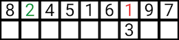
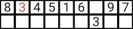
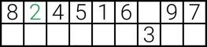

# Sudoku Solver

----

## Part 0: Definitions & Data Structures

----

### Definitions
**Cell** - A single position on a board where a number can go.  
**Square** (or "3x3 square") - the 3x3 square on a sudoku. A cell's square is the square that the cell lies in.  
**possible values** - The potential values for a cell, given the values that already appear in the cell's row, column and square. Will consist of, at most, the number 1 to 9.   


### Data Structures
The program stores the sudoku board as a 2D-numpy array. An empty cell is denoted by a zero.  
Example:
```
[[1, 4, 8, 2, 6, 0, 3, 7, 5],  
 [6, 0, 0, 7, 3, 5, 1, 4, 8],  
 [3, 5, 7, 4, 8, 1, 0, 9, 2],  
 [5, 7, 6, 1, 4, 8, 2, 3, 9],  
 [2, 9, 1, 6, 5, 3, 7, 8, 4],  
 [4, 8, 3, 0, 7, 2, 5, 1, 6],  
 [9, 3, 2, 8, 1, 6, 4, 5, 7],  
 [7, 6, 5, 3, 9, 4, 8, 2, 1],  
 [8, 1, 4, 5, 2, 7, 9, 6, 3]]
 ```

**possible_values** is a 3D-list of varying size. It can be pictured as a 2D-array with each element a list of possible values for the corresponding cell in the sudoku board. A list with 1 element indicates that this value can be the only one for the corresponding cell, or that the corresponding cell is non-zero (it's value will be the element in the list).  
Example:

```
[[[9],    [1, 2], [6],    [1, 5], [7],    [1],    [4],    [8],    [3]   ],
 [[1, 3], [1, 5], [1, 8], [4],    [5, 6], [1, 6], [2],    [7, 8], [6, 7]],
 [[8],    [7],    [4, 8], [5, 6], [2],    [3],    [5, 6], [1],    [6, 9]],
 [[5],    [2, 6], [2, 8], [3, 6], [3, 4], [4, 6], [1],    [2, 3], [2, 4]],
 [[1, 7], [4],    [1, 9], [2],    [3, 5], [8],    [3, 9], [6],    [7, 9]],
 [[1, 2], [1, 2], [3],    [1, 6], [4, 6], [1, 4], [8, 9], [2, 4], [5]   ],
 [[1, 2], [3],    [1, 2], [7],    [4, 6], [2, 4], [6, 9], [5],    [1, 2]],
 [[1, 2], [1, 2], [7],    [3, 6], [3, 4], [5],    [3, 6], [2, 3], [1, 2]],
 [[4],    [2, 6], [5],    [3, 6], [1],    [2, 6], [7],    [2, 3], [8]]]
 ```

## Part 1: Backtracking &  Constraint Satisfaction

----

This coursework  follows the code provided in the 8 Queens Revisited jupyter notebook, from week 2 of the course, as was advised as a good starting point. This code, whilst built for another game, provides a solid, basic structure for solving a problem with backtracking (more specifically, depth-first search) and constraint satisfaction.  
  
### Backtracking
The concept of backtracking consists of trying a potential state for a game, given an initial state, by making one change to the initial state, checking the new state is a valid state, and if so, repeating this step, but with the newly created state as the initial state, until the goal state is met. If all potential states for a given state are tried, but none are valid, we go back to the state we previously guessed the state for, mark the potential state as invalid, and try another potential state and again, recurring for other potential states.  
  
For sudoku, this would involve trying a number in a cell, testing if the number is valid, then repeating for another cell, with the previous cell locked in. If all values for a cell are tried, and none are valid values, we go back to the previously assigned cell, and try the next value. This process can be modelled as a binary tree, read in depth-first order. Suppose we are given the following extract of a sudoku, and we aim to solve the first row, going left-to-right, we first try the number 1 in the second cell.


We first try the number 1.


After placing 1 into the cell, we check if this state is valid. We discover it is not as the number 1 already exists in this row, so we try the next number, 2. 


This passes our first test of validity, as no 2 exists in the row (we can assume it does not appear in the same square or column as well). We lock this number in, and move onto the next cell, cell 5. We repeat the above process, going through the number 1 to 9, stopping if find a valid value for this cell 




It is obvious to see that no number will work as for each number, it already exists in the row, or in the case of 3, the column. We must go back toe the previous cell, cell 2, and try the next value.



We see 3 works, lock it in, and move onto cell 5. This time, we discover that the number 2 works, lock it in. We can now stop as we have achieved our goal of solving the top row.


In the case of a 9x9 sudoku, this strategy is carried forwards for all cells on the board. 

Backtracking has the benefit of always finding a solution to a problem, given one exists. Depending on the implementation, it can find one solution, or, given the algorithm is not stopped until is has tested all possible combinations, all solutions. On the other hand, it can be very slow at finding solutions, given the naivety of the program.
<br>

### Constraint Satisfaction

Constraint satisfaction serves as way to solve problems where multiple states can be chosen. It works by limiting the potential states to those that satisfy a given set of rules and limitations. It can serve as an improvement for a backtracking solution by limiting the number of possible states that must be checked for each initial state. This can serve as a big speed boost in some cases.

In the case of sudoku, we can look to the commonly used method of 'pencil marking' [1] as a way of constraint satisfaction. Using the same example as above, we would start by defining the numbers that each cell could possibly be, by eliminating the numbers it *cannot* be.

Assume each empty cell can be any number in the range 1 to 9.


For each empty cell, we remove any number that appears in the same row, column and 3x3 square as the empty cell. After doing this for the first row in the above example, we are left with:


From here, we adopt a similar strategy as before with backtracking, by trying a value in a cell, then trying all possible values in the next cell. We alter it 2 ways, 1) by choosing values that only lie in the pencil markings for a cell (its potential values) and 2) by removing the chosen values from the potential values of all other cells in the same row, column or square. If we reach a cell with no pencil marks, we know we have made a wrong move somewhere, and backtrack to the previous trying it's next value.

  
(No more possible values in cell 5, back track and try the next value for cell 2)  


<br>
Up to this point, my implementation of the sudoku solver roughly follows the steps set out in the constraint satisfaction section. Some optimisations have been made upto this point, such as after a value is placed in the table, the algorithm will fill in all singleton cells (that is, cells where there is only one option to go into it), in a recursive fashion. For example, given a cell with only one value, if filling in this value will tighten the constraints on another cell, making the other cell a new singleton, the algorithm will see this and also fill in the new singleton. It will do this recursively, till there are no singletons left in the board.

They way in which the program chooses the next cell is currently random, and the order of the values tried for a given cell is currently in increasing numerical order. This method is able to solve any sudoku, but can take upwards of 1 minute to solve some hard problems. It is clear that optimisations must be made to speed this up.

## Part 2: Optimisations

___

### Choosing The Next Best Cell

As stated previously, the next cell chosen to fill in on a sudoku board is currently random. Having something chosen randomly is not a great solution as run times can vary wildly, depending on which cells were chosen. This means the challenge becomes figuring out which cell to choose next; one of the ways in which we can do ths is by choosing the cell with the least possible values next. 

Given two cells, one with only two possible values and one with nine possible values, when choosing a random number from each, you have 50% chance, and an 11.1% chance picking correct from each cell, respectively. This means, in an attempt to avoid backtracking as much as possible, we will choose cells with a higher probability of picking correct. This is done by simply hashing the index of an empty cell by the number of possible values for it. We can then choose the cell with the least possible values. In the case of a tie, with multiple cells having the lowest number of possibilities, we can choose randomly, or just choose the first. The latter was adopted in this case. There is no doubt that further optimisations could be made here, however due to time constraints, and the small increase in efficiency (if at all present and noticeable), it was not worth exploring any.


### Choosing The Order Of Values To Try For A Cell

Another optimisation made early on was the order in which to try the values for a cell. Currently, the order of the values in a cell to be tried is in increasing numerical order (or random in the 8 queens revisited code). A way to improve this would be to order the values by the number of times they occur in the possible values for each cell in the cell's row, column and square.  
For example, given the following square, if we are trying the values for the top-middle cell, we may want to start with the number 5, as in the square, there is a 1/2 chance of it being here. If we guess wrong, we try 2 next as there is a 1/3 chance of it being here. Lastly, it does not matter the order of 6 and 8 as they carry equal probability. This same logic can be used for the row and column as well, and we take the minimum number of occurrences out of the 3 directions. We then order the values based of these values.


There is no doubt that this is not the best solution, but it was able to improve the average time taken to solve the harder sudokus.

With this, and the previous optimisation implemented, the time taken to solve the harder sudokus has dropped dramatically; the average hard sudoku takes around 1.5-2 seconds, with worst case performance on one sudoku taking around 7 seconds.
Whilst these times are more acceptable than waiting a full minute for a solution, they can still be quicker.


### Hidden Singles

The next step in the project was to implement some sudoku solving techniques. The first of these was a technique known as hidden singles. This technique involves, as the name suggests, finding a row, column or square where a possible value occours only once in any cell in that row, column or square. The word hidden comes from the fact that the number may be hidden amongst other numbers as, unlike a singleton, a hidden single can occur in a square with up to 8 other possible values. Take the following example:


Whilst no cells in this row are singletons, we can still place a value. If we look at cell 2, we see that 8 is a possible value for this cell but looking at the rest of the empty cells in the row, we see that 8 cannot go anywhere else, so despite cell 2 having the most options in the row (in terms of possible values), we can put an 8 in there with full confidence it is correct.

A way to implement this for a row of cells would be as follows:
```
let ls be an array of 9 empty lists

for every empty cell in a row:
    for every possible value in the cell:
        append the coordinate of the cell to ls[possible value - 1]
        // possible value - 1 as indexing requires 1 -> 0, 2 -> 1, etc.

if any sub-lists in ls array have length == 1: 
    // If len == 1, we know that the index of this coordinate only appeared once
    set single := index of sub-list with length(sub-list) == 1 
    set coordinate := lone element of sub-list
    set row[coordinate] := index    
```

This should be repeated for every row, column and square on a sudoku board

From learn-sudoku.com: [2]
> The definition of a hidden single is when a pencil mark is the only one of its kind in an entire row, column, or block.

### Naked Pairs

Lastly, a naked pair is a pair of cells that lie in the same row, column or square and  each contain 2 identical elements. These come in useful as they allow us to eliminate these 2 values from every other cell in the row, column or square they belong to. 

As always, it can be easier to give an example:


In the above row, cells 3 and 7 both contains the numbers 5 and 9. We can be confident that 5 must go in on of the cells, and 9 in the other, despite them being possibilities for other cells. We know this to be the case as if 5 went in any cell except 3 or 7, then both cells 3 and 7 could each contain only one number, 9. It is obvious to see that this must be an invalid state as placing the 9 in either cell, leaves the other with no values left. 

We can use this knowledge to clear 5 and 9 from any other cell in the row. After doing this, the remaining row would look like the following:


Whilst identifying these naked pairs has not solved the cells they lie in, in this case it has enabled to solve cell 5, and in turn cell 2.

The underlying logic of naked pairs can also be extended to multiples greater than 2, such as naked triples or naked quad, where instead of 2 cells with 2 matching values, you must find 3 cells with 3 matching values, or 4 cells with 4 matching values respectivly. [3]

Implementing naked pairs search on a row could look like the following:
```
for cell := row:
    for cell2 := in each cell AFTER cell in the row:
        if cell == cell2 and length(cell) == 2:
            for each cell3 in row:
                if cell3 == cell or cell3 == cell2:
                    skip
                if cell3 contains any elements in cell, remove them from cell3
```

## References

---

[1] -  Learn-sudoku.com, 2008. *A note on Pencil Marks* [Online]. Available at: https://www.learn-sudoku.com/pencil-marks.html. Last accessed: 01/03/2021

[2] -  Learn-sudoku.com, 2008. *Hidden Singles* [Online]. Available at: https://www.learn-sudoku.com/hidden-singles.html. Last accessed: 15/03/2021

[3] - sudoku-wiki.org, 2021. *Naked Candidates* [Online]. Available at: https://www.sudokuwiki.org/Naked_Candidates. Last accessed: 15/03/2021

